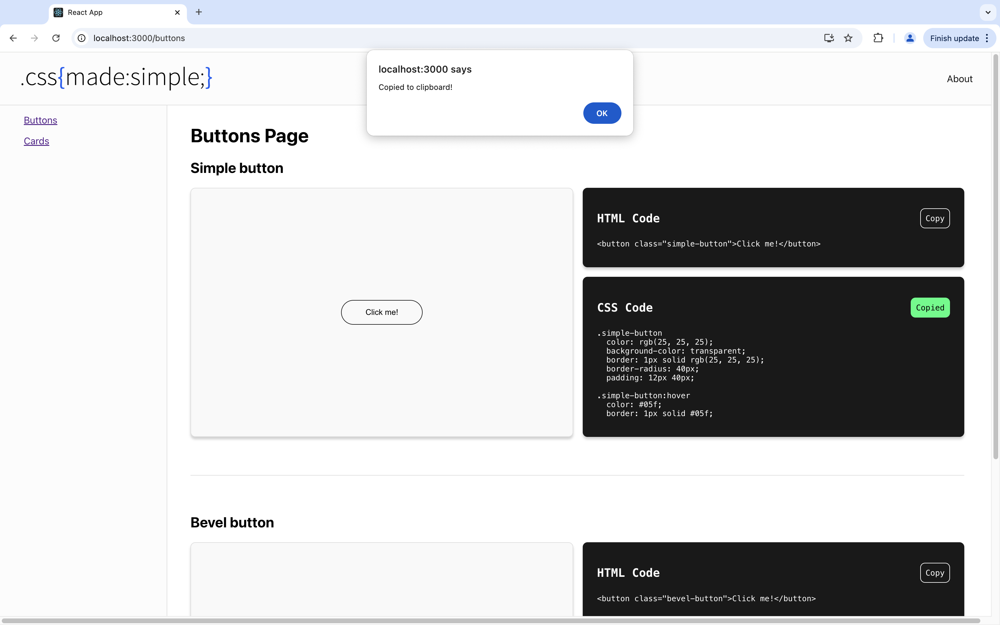
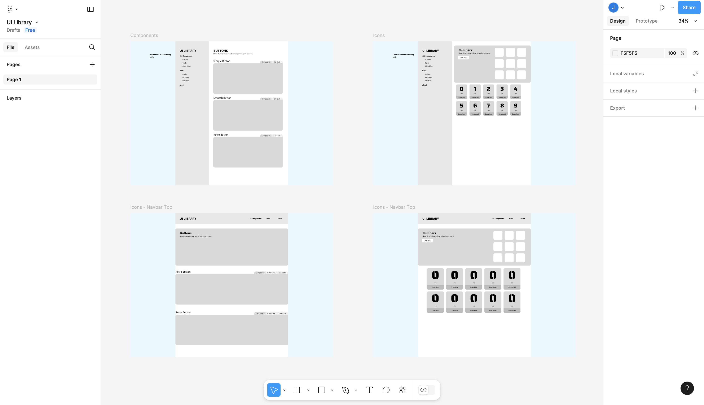

<h1>.css{made:simple;}</h1>

A digital library containing css and html code for carious components to help beginner web and software developers.

<i>(This is a personal project still in development, please check out the "Creation Journey" section to follow along with the development)</i>

<h2>Teck Stack 👨‍💻</h2>

   

<h2>Creation Journey 🚀</h2> 

<h3>Update 2</h3>

<ul>
  <li>Created component basic layout</li>
  <li>Created functional copy to clipboard button</li>
  <li>Implemented visual feedback for successful copy</li>
  <li>Added "Simple button" and "Bevel Button"</li>
</ul>

<h3>Update 1</h3>

<ul>
  <li>Sketched concept in Figma</li>
  <li>Built React.js project</li>
  <li>Created initial wireframe</li>
</ul>
